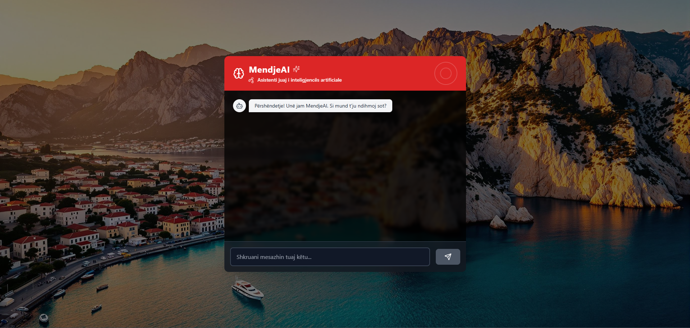

# MendjeAI 🤖

[](https://reactjs.org/)
[](https://vitejs.dev/)
[](https://tailwindcss.com/)
[](https://vercel.com)
[](https://openai.com)

Albanian Language AI Chat Assistant powered by OpenAI's GPT models.

## Overview
MendjeAI is a Progressive Web App that provides an AI chat interface fully in Albanian language. It's designed to be simple, fast, and accessible across all devices.



## Features
- 🇦🇱 Full Albanian language support
- 💬 Real-time chat interface
- 🤖 AI-powered responses using GPT-3.5 Turbo
- 📱 Progressive Web App capabilities
- 🎨 Clean, modern UI with TailwindCSS

## Tech Stack
- **Frontend**: React + Vite
- **Styling**: TailwindCSS
- **AI**: OpenAI Chat Completions API
- **Model**: GPT-3.5 Turbo
- **Hosting**: Vercel (Frontend)

## Project Structure
```
mendje-ai/
├── src/
│   ├── components/
│   │   └── Chat/               
│   │       ├── ChatBox.jsx     # Main chat interface
│   │       └── Message.jsx     # Message bubbles
│   ├── services/
│   │   └── ai.js              # OpenAI integration
│   ├── translations/
│   │   └── al.js              # Albanian translations
│   ├── App.jsx
│   └── main.jsx
├── public/
│   └── manifest.json          # PWA manifest
```

## Setup
1. Clone the repository
2. Install dependencies:
   ```bash
   npm install
   ```
3. Create a `.env` file in the root directory with:
   ```env
   VITE_OPENAI_API_KEY=your_api_key_here
   ```
4. Run development server:
   ```bash
   npm run dev
   ```

## Development Progress
- ✅ Project initialization
- ✅ Basic project structure
- ✅ Chat interface components
- ✅ OpenAI API integration
- ✅ Albanian translations
- ✅ Basic PWA setup
- 🔄 Deployment configuration (pending)
- 🔄 Production testing (pending)

## Contributing
This project is currently under active development. Feel free to submit issues and pull requests.

## License
ISC